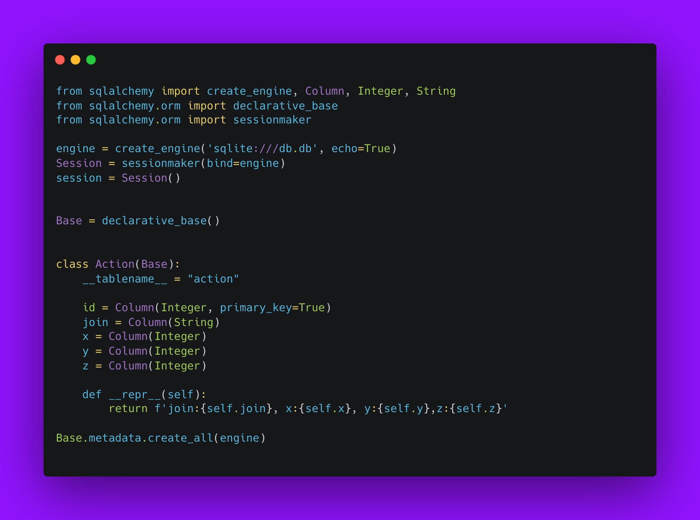
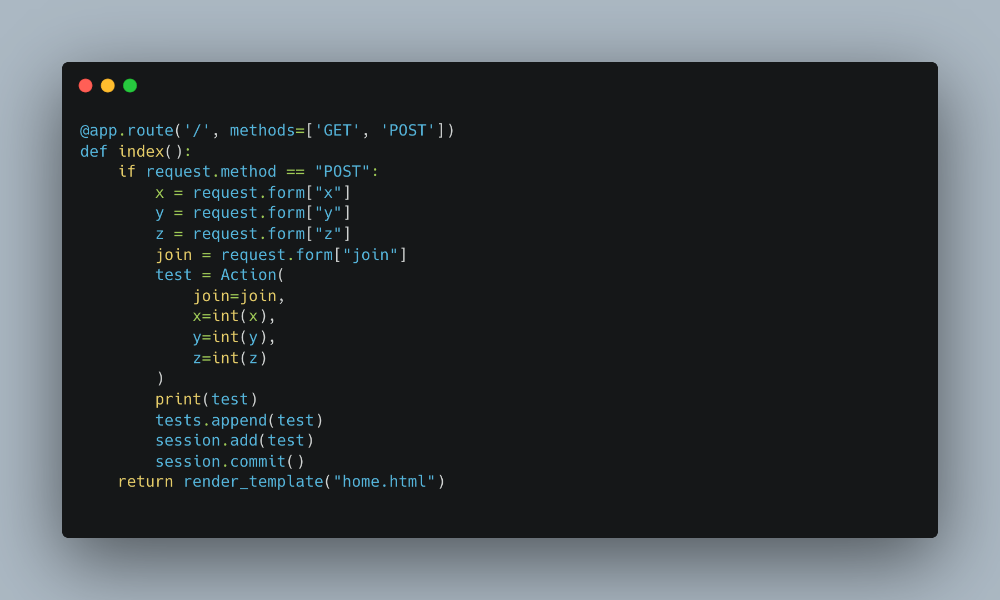
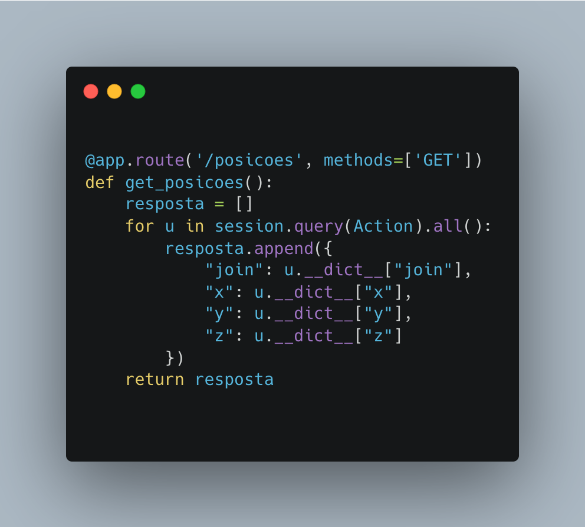
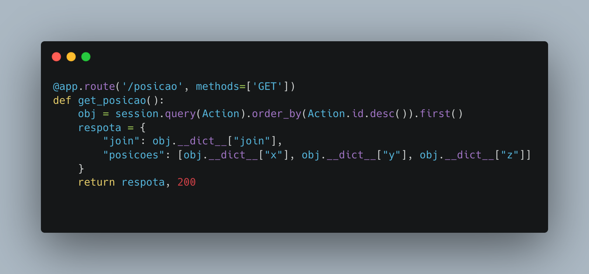

<table>
<tr>
<td>
</td>
</tr>
</table>

# Desenvolvimento da API
O objetivo deste projeto é conceber e implementar um protótipo de Simulador de Braço Robótico, integrando a um motor gráfico(GODOT) uma API.

## Banco de Dados

Para esse projeto optei por usar a ORM sqlAlchemy e o banco de dados sqlite. 

 

A tabela <i>Action</i> é a responsável por conter todas as informaçãos necessárias para movimentação do robô.

## Rotas

### 127.0.0.1:5000/

Essa é a rota inicial, serve para retornar a home da aplicação que contem um form para fazer post do join e das posições.

### 127.0.0.1:5000/posicoes

Essa rota serve para retornar todas as posições do banco de dados.

### 127.0.0.1:5000/posicao

Essa rota serve para retornar a última posição do banco de dados.

